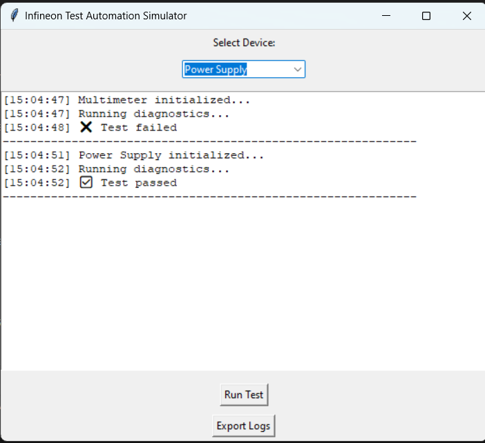

# Infineon Lab Test Automation Simulator 🧪

A simple Python GUI demo simulating lab hardware testing using `tkinter`.

### 🎯 What it does
- Simulates tests on lab devices like multimeters, signal generators, etc.
- Provides step-by-step diagnostics logs.
- Demonstrates how test automation frameworks function in validation labs.

### 💻 Technologies Used
- Python
- Tkinter for GUI
- Threading (non-blocking UI)
- Time module for simulating delays

### 📸 Preview



### 📁 How to Run
```bash
python test_simulator.py
